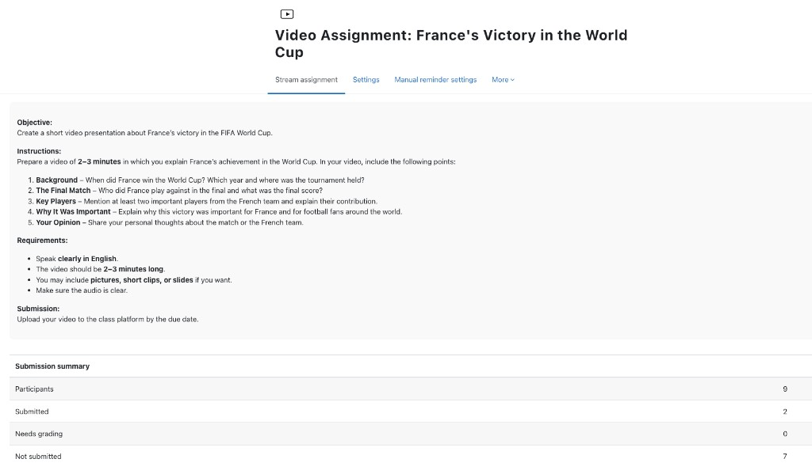
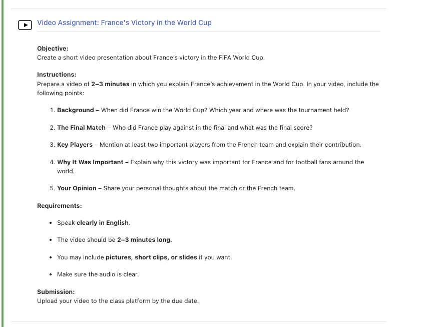
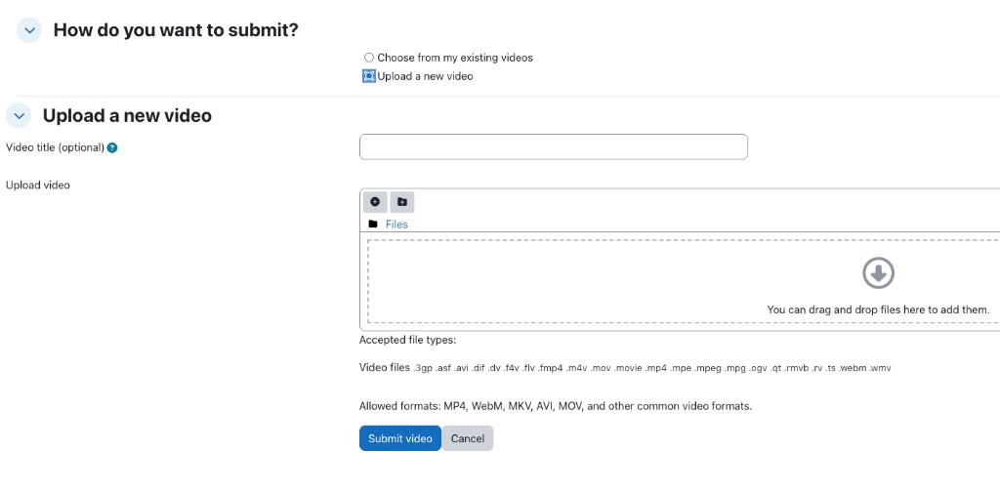
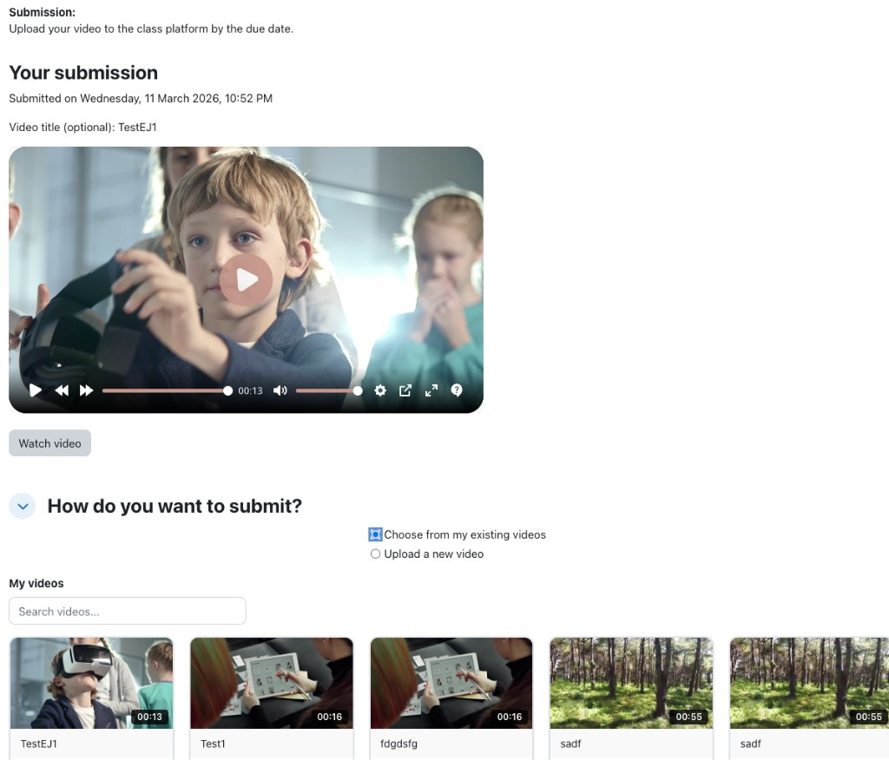
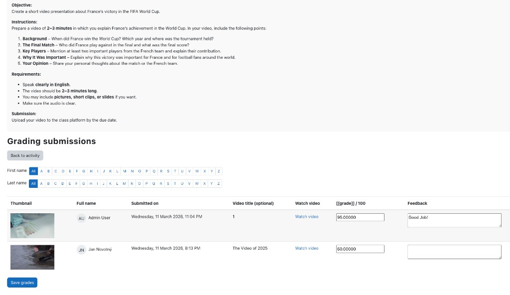

# Stream assignment (mod_streamassign)

A Moodle activity that lets participants submit a video for grading. Videos are uploaded to or chosen from an external **Stream** platform (via the [local_stream](https://moodle.org/plugins/local_stream) plugin). Teachers view submissions and grade them on a dedicated grading page with thumbnails, grades, and feedback.

---

## Features

- **Two submission methods:** Students can **upload a new video** or **choose from their existing videos** on the Stream platform.
- **Submission summary:** On the activity view page, teachers see counts for participants, submitted, needs grading, and not submitted (similar to standard Assignment).
- **Grading page:** Paginated table with thumbnails, video title, “Watch video” link, grade (out of 100), and feedback. Optional filters by first/last name initial.
- **Video processing:** The view page shows an embedded player only when the video is ready; until then it shows a “processing” message and polls every 30 seconds.
- **My videos grid:** When “Choose from my existing videos” is selected, students see a searchable grid of their Stream videos with thumbnails and duration.
- **Privacy:** Submission data is stored in Moodle; video files and metadata are on the Stream platform (see privacy strings in the plugin).

---

## Requirements

- **Moodle** 3.4+ (requires 2017111300).
- **local_stream** plugin with Stream URL and API key configured (Site administration → Plugins → Local plugins → Stream).

---

## Installation

1. Install and configure the **local_stream** plugin (Stream URL and API key).
2. Copy the `streamassign` folder into your Moodle `mod/` directory.
3. Visit **Site administration → Notifications** and complete the upgrade.
4. (Optional) From the Moodle root, run `npx grunt amd` to build the AMD module for production; without it, Moodle may load from `amd/src` in debug mode.

---

## Configuration

- **Stream settings** are taken from **local_stream** (Site administration → Plugins → Local plugins → Stream). The activity does not define its own URL or API key.
- **Activity settings** (when adding/editing a Stream assignment): standard name, description, availability dates, and grade scale (e.g. 0–100). The description supports the usual Moodle editor (Objective, Instructions, Requirements, Submission, etc.).

---

## Usage

### For teachers

1. **Add the activity**  
   Turn editing on → **Add an activity or resource** → under **Activities**, choose **Stream assignment**.

2. **Configure the activity**  
   Set name, description (objective, instructions, requirements, submission instructions), availability, and grading (e.g. out of 100). Save.

3. **View and grade**  
   - On the activity view page you’ll see the **Submission summary** (participants, submitted, needs grading, not submitted) and a **Grade submissions** button.  
   - Click **Grade submissions** to open the grading page.  
   - Use **Back to activity** to return.  
   - Use the **First name** / **Last name** filters and pagination if there are many participants.  
   - For each submission: check thumbnail, open **Watch video**, enter **Grade** (e.g. / 100) and **Feedback**, then click **Save grades**.

### For students

1. **Open the activity**  
   Read the objective, instructions, requirements, and submission instructions on the view page.

2. **Submit a video**  
   - **Upload a new video:** Choose **Upload a new video**, optionally enter a video title, then drag-and-drop or select a file (e.g. MP4, WebM, MOV). Click **Submit video**.  
   - **Use an existing video:** Choose **Choose from my existing videos**, use the search if needed, click a video in the grid to select it, then click **Submit video**.

3. **After submission**  
   The page shows “Your submission” with the submitted video. If the video is still processing, a message is shown and the player appears automatically when ready (page checks every 30 seconds). You can change your submission by submitting again (new upload or different existing video).

---

## Screenshots

### Activity view (teacher) – submission summary

Assignment description and submission summary: participants, submitted, needs grading, not submitted.

### Activity view (student)

Objective, instructions, requirements, and submission instructions.

### Submission – upload a new video

“How do you want to submit?” with **Upload a new video** selected; optional title and file drop zone.

### Submission – choose from my videos

**Choose from my existing videos** selected; searchable “My videos” grid with thumbnails and duration.

### Grading submissions page

Grading table with thumbnails, grades, feedback, filters, and Save grades.

---

## File structure (main files)

- `view.php` – Activity view: description, submission summary (for graders), submission form or “Your submission” with embed/polling.
- `grading.php` – Grading UI: submissions table, pagination, initials filter, save grades.
- `classes/submission_form.php` – Form: upload vs existing, “My videos” section, file manager.
- `classes/stream_uploader.php` – Stream API: upload, user videos, thumbnails, embed URL with JWT.
- `locallib.php` – Handles upload and “existing video” submission.
- `check_thumbnail.php` – AJAX endpoint for thumbnail/readiness check (used by view page polling).
- `amd/src/videopicker.js` – Front-end: method choice, “My videos” visibility, search, card selection, submit fix.
- `lib.php` – Supports, grading summary, content item (archetype for Activities tab).

---

## License

GPL v3 or later.  
Copyright (c) 2025 mattandor.
